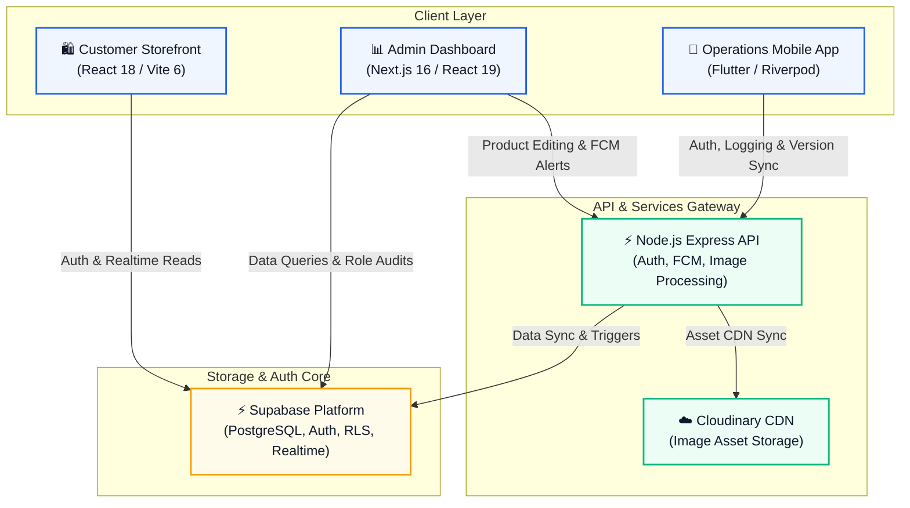

# 🏗️ Zentory — System Architecture

This document details the architectural layout, core data models, database triggers, and security mechanisms of the **Zentory B2B Inventory & Ordering Platform**.

---

## 🌐 System Architecture Overview

Zentory is designed as a decoupled, multi-client system centered around a unified database and a secure API Gateway.

---

## 🗄️ Core Database Schema

The Postgres database (managed via Supabase) maintains structural integrity across the ecosystem. Tables utilize PostgreSQL enums for status control and custom constraints to prevent operational errors.

### 1. Database Tables Reference

| Table Name | Description | Main Writers / Owners |
| :--- | :--- | :--- |
| **[`users`](file:///c:/Users/DELL/.antigravity/apps/B2B%20Stock%20App/supabase/schema.sql#L33-L40)** | User profiles containing authorization roles (`admin`, `manager`, `worker`, `customer`). | Supabase Auth Trigger |
| **[`suppliers`](file:///c:/Users/DELL/.antigravity/apps/B2B%20Stock%20App/supabase/schema.sql#L42-L49)** | Registry of inventory suppliers and manufacturers. | Admin Dashboard |
| **[`workers`](file:///c:/Users/DELL/.antigravity/apps/B2B%20Stock%20App/supabase/schema.sql#L51-L85)** | Profile records for warehouse floor workers (supports phone number validation). | Admin / Auth Sync Trigger |
| **[`worker_login_otps`](file:///c:/Users/DELL/.antigravity/apps/B2B%20Stock%20App/supabase/schema.sql#L87-L102)** | Temporary OTP tokens for authenticating mobile operations workers. | Express Server |
| **[`notification_devices`](file:///c:/Users/DELL/.antigravity/apps/B2B%20Stock%20App/supabase/schema.sql#L104-L147)** | Firebase Cloud Messaging (FCM) tokens mapped to users and device platforms. | Express API / Mobile Client |
| **[`products`](file:///c:/Users/DELL/.antigravity/apps/B2B%20Stock%20App/supabase/schema.sql#L149-L168)** | Global product catalog, tracking quantities, low-stock thresholds, and carton scaling (`pcs_per_carton`). | Admin Dashboard / Seeding scripts |
| **[`warehouses`](file:///c:/Users/DELL/.antigravity/apps/B2B%20Stock%20App/supabase/schema.sql#L170-L196)** | Inventory locations metadata (supporting physical coordinates or maps URLs). | Admin Dashboard |
| **[`warehouse_product_stocks`](file:///c:/Users/DELL/.antigravity/apps/B2B%20Stock%20App/supabase/schema.sql#L198-L207)** | Location-specific inventory levels, grouped by warehouse, product, and color variant. | Database Transaction Trigger |
| **[`orders`](file:///c:/Users/DELL/.antigravity/apps/B2B%20Stock%20App/supabase/schema.sql#L209-L229)** | Customer orders containing item arrays, pricing, checkout status, and branding assets. | Customer Storefront |
| **[`transactions`](file:///c:/Users/DELL/.antigravity/apps/B2B%20Stock%20App/supabase/schema.sql#L231-L274)** | Audit trail logs for stock movements (`stock_in`, `stock_out`, or adjustments). | Mobile App / Database Trigger |

---

## ⚙️ Database Automation (Postgres Triggers)

To guarantee high data consistency, stock verification and profile synchronization are handled directly at the database layer using Postgres triggers:

1. **`trigger_update_stock_status`**
   - *Executed:* Before insert/update on `products.quantity`.
   - *Logic:* Automatically updates the product status enum to `out_of_stock` (qty $\le$ 0), `low_stock` (qty $\le$ threshold), or `in_stock`.
2. **`trigger_prepare_transaction_defaults`**
   - *Executed:* Before insert on `transactions`.
   - *Logic:* Resolves product code, product name, color name (defaults to `'Default'`), and warehouse ID/name prior to writing the transaction.
3. **`trigger_stock_transaction`**
   - *Executed:* After insert on `transactions`.
   - *Logic:* Applies the stock change atomically:
     - On `stock_in`: Increments total product quantity, updates the JSON color stock array, and updates/inserts local warehouse stocks.
     - On `stock_out`: Validates that global stock AND local warehouse stock are sufficient. If not, it rolls back the transaction and raises a Postgres exception preventing negative inventory.
4. **`on_auth_user_created` & `sync_worker_from_user`**
   - *Executed:* After insert on `auth.users` and update on `public.users`.
   - *Logic:* Automatically populates user profile tables and creates matching entries in the `workers` directory.

---

## 🔒 Security & Row-Level Security (RLS)

All tables in the Postgres database have Row-Level Security (RLS) enabled. An authorization helper function, `public.is_admin()`, verifies if the executing user has admin/manager privileges:

- **Products & Warehouses:** Publicly readable by all users (anonymous storefront catalog access); write operations (insert, update, delete) are strictly restricted to accounts flagged with `admin` or `manager` roles.
- **Orders:** Clients can insert orders without signing in (for guest checkout pipelines). Customers can view their own orders (`customer_id = auth.uid()`), while administrators can query all orders.
- **Transactions & Logs:** Writing transaction stock logs is restricted to warehouse workers and administrators.
